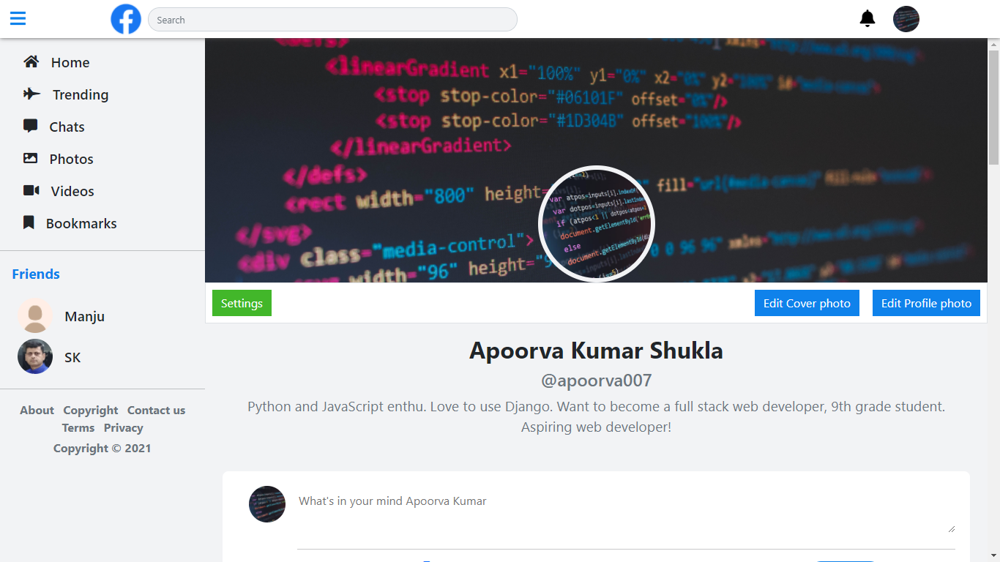
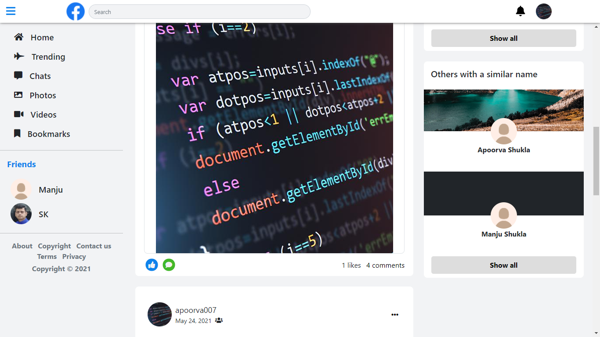
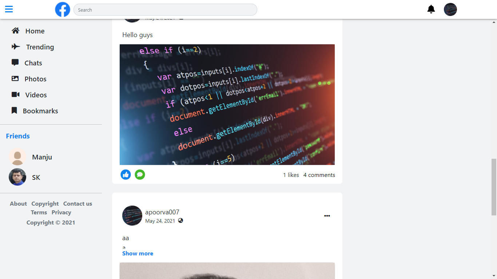
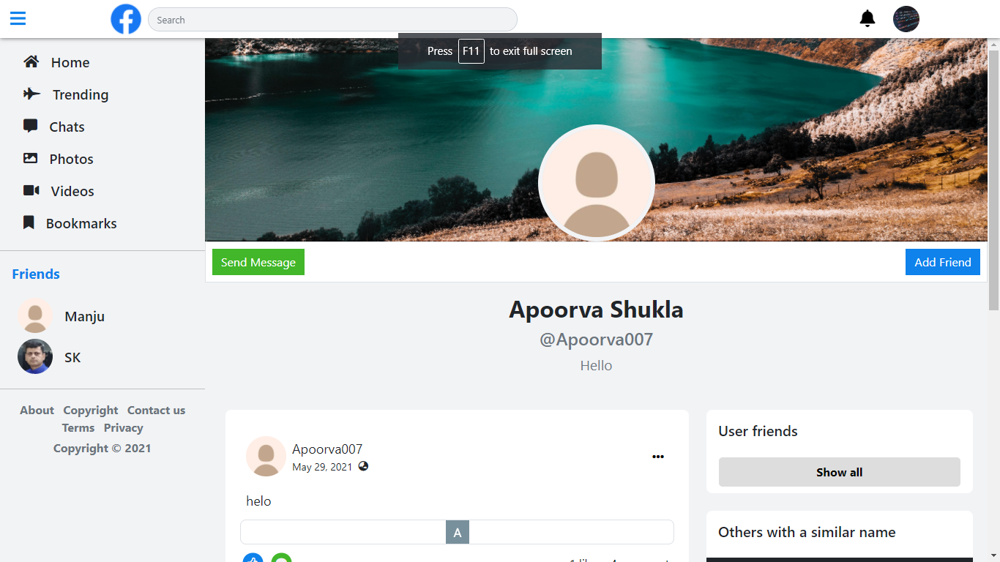
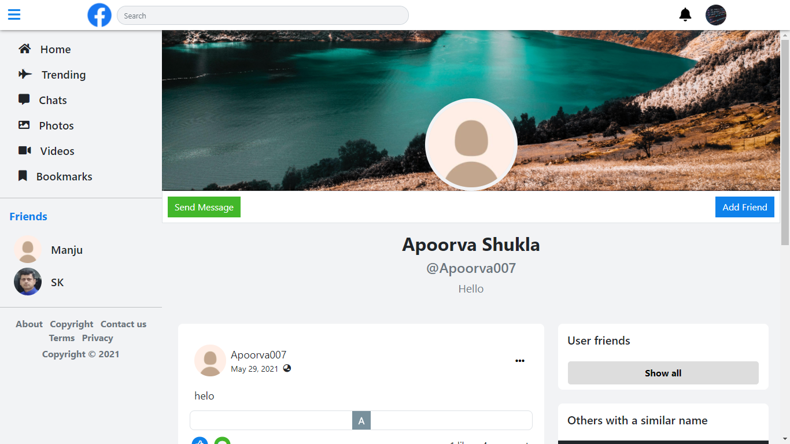
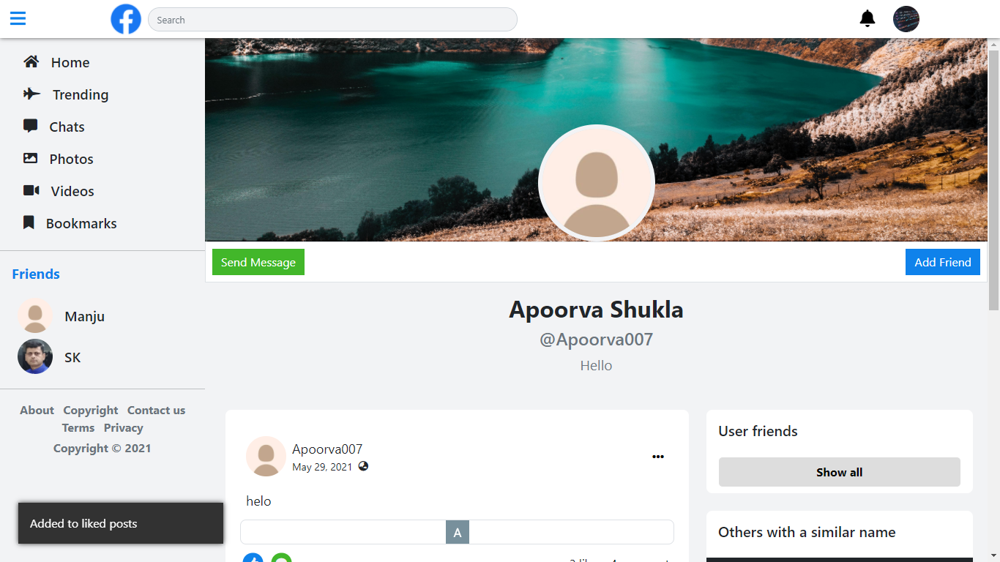
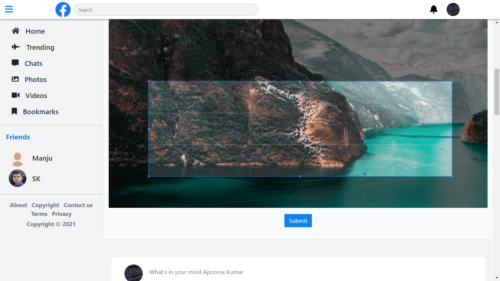
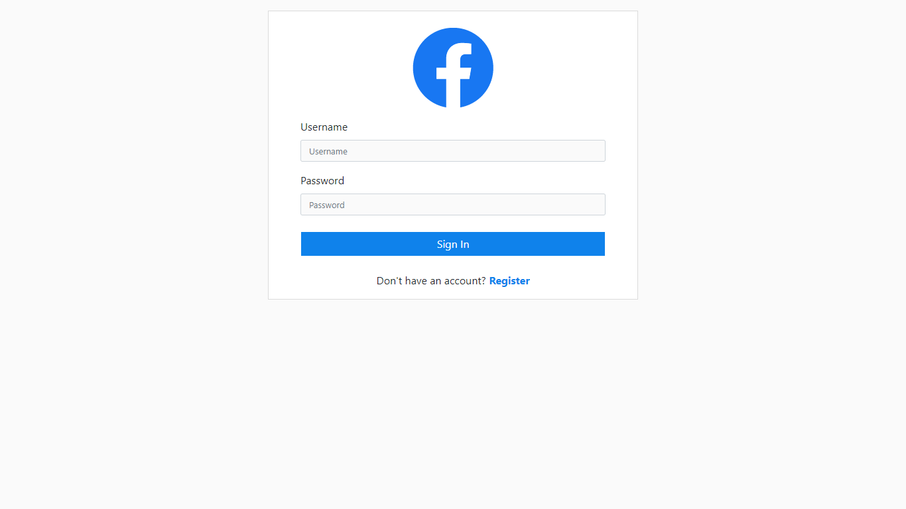
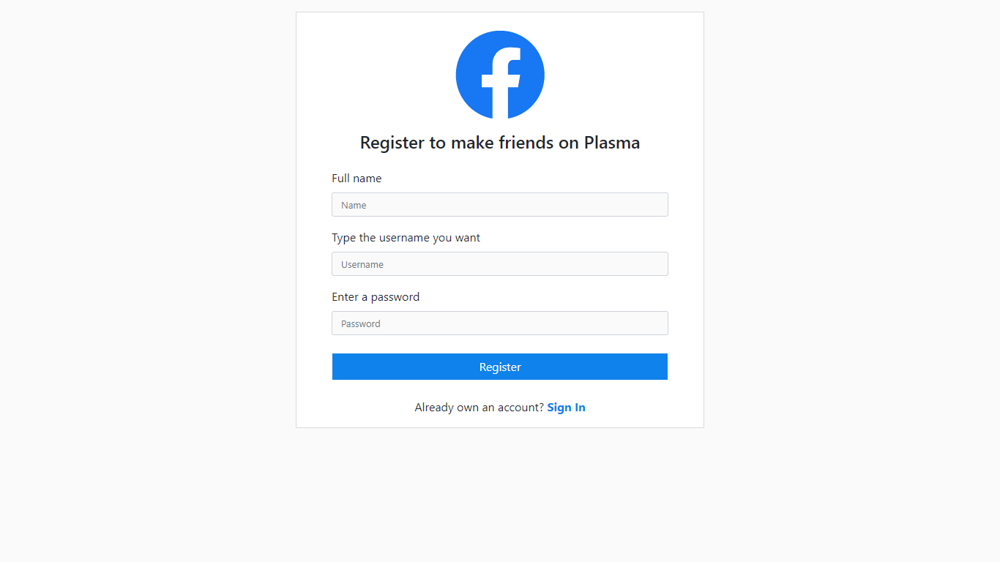
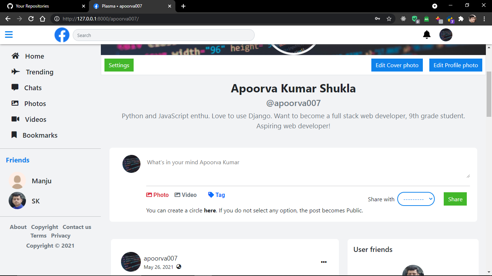

# Plasma
A social media website built on top of Django Web Framework.

## The features available to users
1) Add Posts - Users can upload posts with a caption and either an image or video.

2) Can check everyone's post and also like and comment on the posts.

3) Users can edit or delete their photos too.

4) Without authentication, users can view the posts but cannot like or comment.

5) Registeration system is complete with password reset option also available to users.

6) Users can edit their profile including profile pic and a short bio about them.

7) Users can view profile of others users and can send them friend requests.

8) Users can send friend request, cancel requests, accept requests, reject requests or even unfriend their friends.

#### And many more...

## Technologies used
1) Frontend: HTML, CSS (Bootstrap5 + Custom CSS), AJAX

2) Backend: Django

3) Storage: Sqlite db

Feel free to make a pull request, and I will approve it if it makes sense 😛.

# Why is your code too bad
Thats because I am a noob programmer